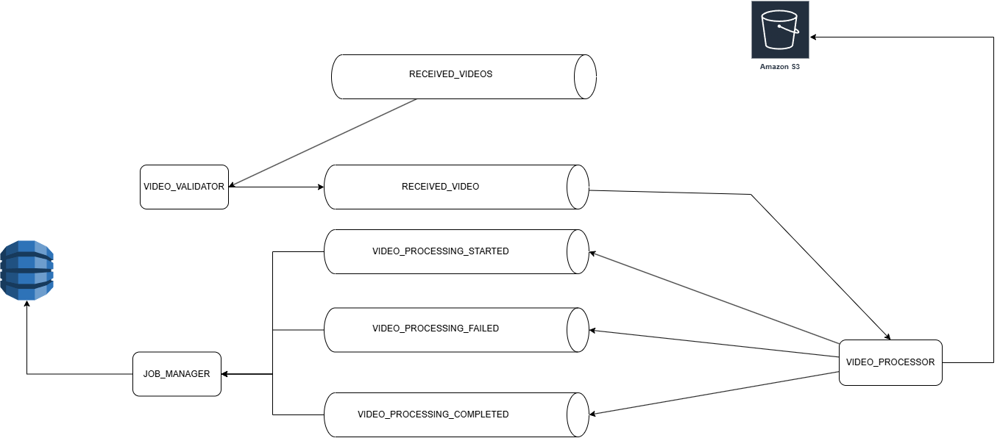
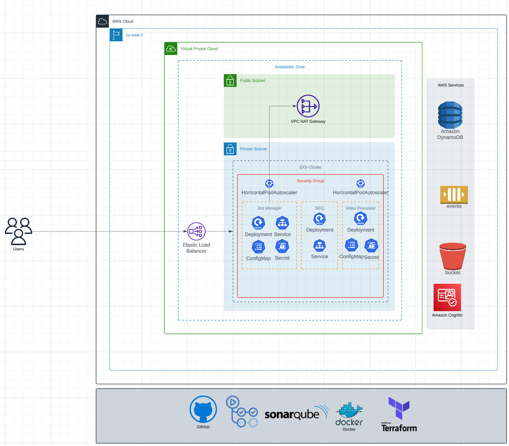

# Job Manager

This repository is part of a project focused on managing jobs for extracting images from videos. It includes several key features and integrations to ensure efficient job management and high code quality.

## Key Features
- **Job Creation and Management**: Handles the creation, scheduling, and execution of jobs that extract images from video files.
- **CI/CD Integration**: Utilizes GitHub Actions for continuous integration and deployment, ensuring that changes are automatically tested and deployed.
  - 
- **Code Quality Assurance**: Integrates with SonarCloud to monitor code quality and coverage, helping maintain high standards.
  - 
- **Collaborative Design**: Includes a link to an Event Storming board on Miro, indicating a collaborative approach to designing the system.
  - [Event Storm](https://miro.com/app/board/uXjVL3XY9ds=/)

## Repository Structure
- **Application Code**: Contains the core logic for job management, including APIs, job scheduling, and execution modules.
- **Tests**: Includes unit and integration tests to ensure the reliability and correctness of the job management functionalities.
- **Infrastructure as Code**: Uses Terraform or similar tools to manage infrastructure, ensuring consistent and reproducible environments.

This repository is essential for orchestrating the extraction of images from videos, providing a robust and scalable solution for job management within the project.

### Services communication (ECST)

### AWS Architecture
